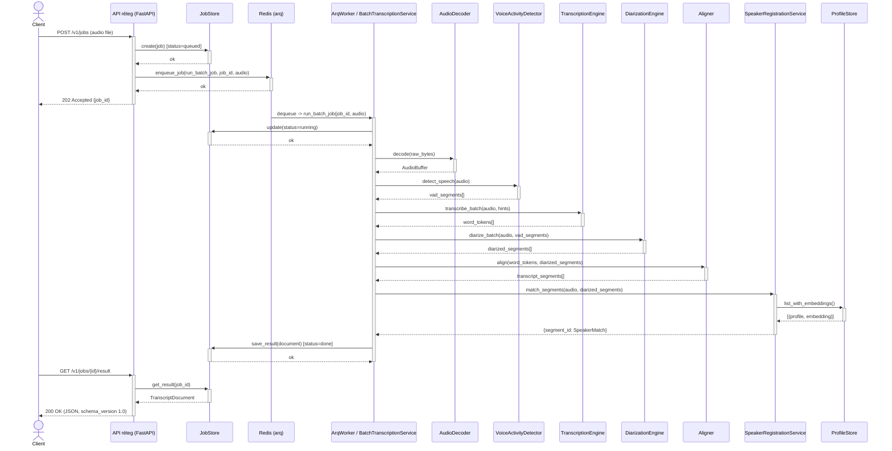

# 1. Szekvenciadiagram — batch leiratozási folyamat

UML szekvenciadiagram (Mermaid `sequenceDiagram` — natívan szabványos UML
jelölés: `actor`/`participant` élettartam-sávok, `->>` szinkron hívás, `-->>`
visszatérés, `+`/`-` explicit aktivációs sáv). A `POST /v1/jobs` kérés teljes
lefolyását mutatja a válasz JSON elkészültéig — ld. `docs/phase1-terv.md` 8.
és 12.1. szakasz a kontextusért, `src/leiratozo/application/batch_service.py`
a tényleges implementációért.

**Megjegyzés:** `queue.backend: inline` (dev/teszt) esetén a `Queue`/`Worker`
elkülönítés elmarad — az API-process maga futtatja le szinkron-inline a
`run_batch_job`-nak megfelelő logikát (ld. `ServiceContainer.submit_batch_job`,
`docs/tradeoffs_and_decisions.md` 3.8. szakasz).
