# 3. Komponens-/interfész-diagram — port–adapter architektúra

UML komponens-/interfész-diagram (Mermaid `classDiagram`, `<<interface>>`
sztereotípiával a 3 fő portra, és `..|>` **realizáció** nyilakkal — szaggatott
vonal + üres háromszög nyílhegy, a klasszikus UML jelölés arra, hogy egy
konkrét osztály megvalósít egy interfészt). Ez teszi láthatóvá a
modellagnosztikusságot: minden portra ≥2, egymástól független, cserélhető
adapter. Ld. `docs/phase1-terv.md` 1. szakasz (kemény megkötés) és 12.3.
szakasz, `docs/tradeoffs_and_decisions.md` a konkrét adapter-választások
indoklásáért.

```mermaid
classDiagram
    class TranscriptionEngine {
        <<interface>>
        +transcribe_batch(audio, language, hints) WordToken[]
        +transcribe_stream(audio_chunks) PartialOrFinalTranscript[]
    }
    class DiarizationEngine {
        <<interface>>
        +diarize_batch(audio, vad_segments) DiarizedSegment[]
        +diarize_live(chunk, state) DiarizedSegment[]
    }
    class SpeakerEmbeddingEngine {
        <<interface>>
        +extract_embedding(audio) Embedding
        +extract_embeddings_for_segments(audio, segments) Embedding[]
    }

    class FasterWhisperEngine {
        batch-natív, szó-szintű időbélyeg
    }
    class VoskEngine {
        natív streaming (Kaldi)
    }
    class RemoteHttpAsrEngine {
        tetszőleges külső HTTP ASR-végpont
    }

    class PyannoteDiarizer {
        mode = batch
    }
    class NemoMsddDiarizer {
        mode = batch
    }
    class DiartLiveDiarizer {
        mode = live_approx
    }

    class SpeechBrainEcapaEngine {
        x-vector
    }
    class ResemblyzerEngine {
        GE2E d-vector
    }

    FasterWhisperEngine ..|> TranscriptionEngine
    VoskEngine ..|> TranscriptionEngine
    RemoteHttpAsrEngine ..|> TranscriptionEngine

    PyannoteDiarizer ..|> DiarizationEngine
    NemoMsddDiarizer ..|> DiarizationEngine
    DiartLiveDiarizer ..|> DiarizationEngine

    SpeechBrainEcapaEngine ..|> SpeakerEmbeddingEngine
    ResemblyzerEngine ..|> SpeakerEmbeddingEngine

    class BatchTranscriptionService {
        <<component>>
    }
    class LiveSessionService {
        <<component>>
    }
    class SpeakerRegistrationService {
        <<component>>
    }

    BatchTranscriptionService ..> TranscriptionEngine : uses
    BatchTranscriptionService ..> DiarizationEngine : uses
    LiveSessionService ..> TranscriptionEngine : uses
    LiveSessionService ..> DiarizationEngine : uses
    SpeakerRegistrationService ..> SpeakerEmbeddingEngine : uses
```

**Olvasási megjegyzés:** a `PluginRegistry` (`src/leiratozo/registry/plugin_registry.py`)
nincs külön berajzolva — ő felel azért, hogy a fenti realizáció-kapcsolatok
közül futásidőben melyik konkrét adapter-osztály töltődik be, kizárólag a
config (`models.asr.adapter`, `models.diarization.batch_adapter` stb.) alapján,
lustán importálva. A diagram tehát a **lehetséges** kapcsolatok teljes
halmazát mutatja — egy adott futó példány ezek közül mindig csak egyet-egyet
példányosít portonként (kettőt diarizációnál: batch + élő).
