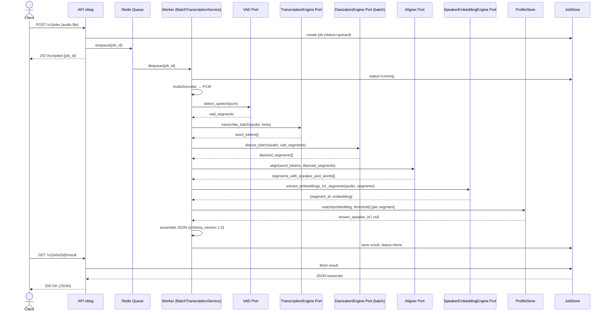
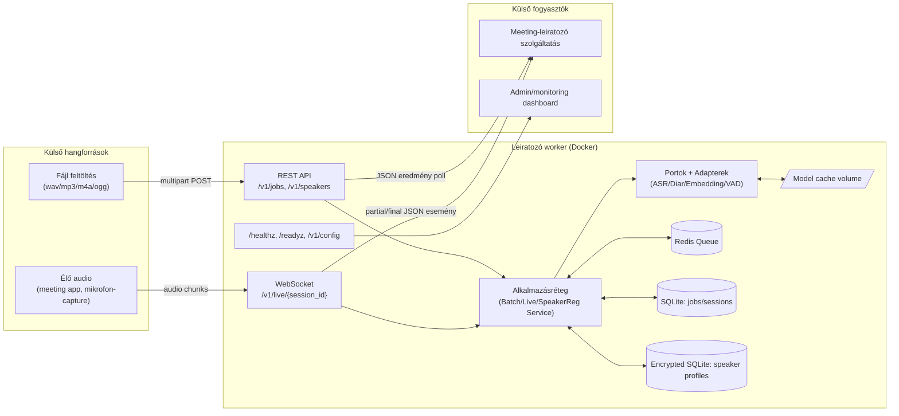
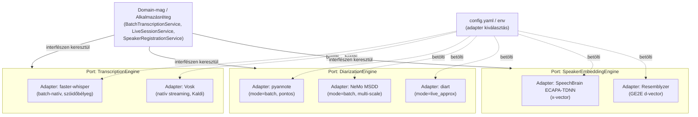

# Fázis 1 — Terv: modellagnosztikus, konfigurálható leiratozó worker

Státusz: **jóváhagyásra vár**. Ez a dokumentum nem tartalmaz implementációt — csak
architektúrát, kontraktusokat és indoklásokat. A 2. fázis (skeleton) csak jóváhagyás
után indul.

---

## 0. Feltételezések és eldöntött kérdések

A felhasználóval tisztázott döntések (2026-09-11):

| Kérdés | Döntés |
|---|---|
| Célnyelv(ek) | Multilingual, magyar+angol fókusszal a teszteléshez; a rendszer nyelvfüggetlen marad configból |
| GPU | Configból váltható (cpu/cuda/auto); fejlesztés/teszt alapból CPU-n fut |
| Terhelés/skála | Kis-közepes, single-node Docker; néhány konkurens batch job + néhány (1-5) egyidejű élő stream |
| Storage | Lokális volume + SQLite (Postgres-re cserélhető ugyanazon SQLAlchemy modellekkel, később) |

További feltételezések, amiket **nem** kérdeztem vissza, mert alacsony kockázatúnak
és később könnyen módosíthatónak ítéltem — de itt explicit jelzem őket:

- **Egyidejű beszélők száma egy session-ön belül:** 1–8 (tipikus megbeszélés-méret). A
  diarizációs adapterek `min_speakers`/`max_speakers` configból hangolhatók, nincs kemény
  felső korlát a kódban.
- **Deployment cél:** Docker / Docker Compose az elsődleges cél ebben a fázisban. Kubernetes
  manifest NEM készül most (a "kis-közepes, single-node" válasszal összhangban) — ha később
  kell, a konténerizált worker változtatás nélkül illeszthető K8s-be.
- **Audio formátumok:** wav/mp3/m4a/ogg/flac dekódolása `ffmpeg`-alapú könyvtárral
  (`av`/`pydub`), egységes 16kHz mono PCM-re normalizálva belső feldolgozásra.
- **Autentikáció/autorizáció:** a komponens egy egyszerű API-kulcs middleware-t kap
  (config: `server.api_key`), de a teljes authN/authZ (pl. OAuth, multi-tenant jogosultság)
  kívül esik a scope-on — feltételezem, hogy ez egy belső komponens, amit egy külső
  API-gateway vagy a beágyazó meeting-szolgáltatás véd. **Jelzem, hogy ha ez nem helytálló
  feltételezés, szólj.**
- **Profil-retenció:** alapértelmezett `profile_retention_days: null` (nincs automatikus
  lejárat, csak explicit törlés) — mert a GDPR jogalap/hozzájárulás kezelése szervezeti
  szintű döntés, ami kívül esik ezen a komponensen; a config viszont támogatja a TTL-t, ha
  a beágyazó szervezet szab retenciós szabályt.
- **Diarizáció adapterei (jóváhagyva, 2026-09-11):** a felhasználó explicit kérte a
  második *batch* adaptert is, nyílt forráskódú megoldások közül a legjobbat. Így a
  diarizációs port **3 adaptert** kap: **pyannote.audio** (batch), **NVIDIA NeMo MSDD**
  (batch, Multi-scale Diarization Decoder) és **diart** (élő, streaming-közelítő). A
  pyannote és a NeMo MSDD architekturálisan is különböznek (szegmentálás+klaszterezés
  vs. multi-scale szegmentálás + neurális diarizációs dekóder), így a "batch" oldalon is
  valódi modellagnosztikusság bizonyítható, nem csak paraméter-váltás. Bónusz: a NeMo
  MSDD Apache-2.0 licencű és NEM igényel HF gated-repo licenc-elfogadást (szemben a
  pyannote-tal) — ez gyakorlati példa arra, hogy az adapter-csere licenc-kockázatot is
  kezelhet. *Kompromisszum:* a NeMo toolkit nehezebb függőség-lábnyom (saját torch/hydra/
  omegaconf verzió-elvárásokkal), ami nagyobb image-méretet és hosszabb build-időt jelent
  — ezt a Dockerfile multi-stage buildjében külön rétegként kezeljük (3. fázis), hogy a
  cache-elhető legyen.

---

## 1. Architektúra — rétegek

```
┌─────────────────────────────────────────────────────────────────┐
│  API réteg (FastAPI: REST + WebSocket)                          │
│  — HTTP kérés/válasz, WS session kezelés, validáció, auth        │
├─────────────────────────────────────────────────────────────────┤
│  Alkalmazás/szolgáltatás réteg                                   │
│  — BatchTranscriptionService, LiveSessionService,                │
│    SpeakerRegistrationService                                    │
│  — KIZÁRÓLAG portinterfészeken keresztül dolgozik                │
├─────────────────────────────────────────────────────────────────┤
│  Domain-mag (tiszta Python, nincs ML-függőség)                   │
│  — entitások: Segment, WordToken, SpeakerProfile, TranscriptJob, │
│    LiveSession; value objectek: TimeRange, Confidence            │
├─────────────────────────────────────────────────────────────────┤
│  PORTOK (Protocol/ABC interfészek)                                │
│  TranscriptionEngine · DiarizationEngine · SpeakerEmbeddingEngine │
│  + kiegészítő: VAD, AudioDecoder, Aligner, JobStore, SessionStore,│
│    ProfileStore, MetricsSink                                     │
├─────────────────────────────────────────────────────────────────┤
│  ADAPTEREK (config alapján, plugin-registry-ből betöltve)        │
│  ASR: faster-whisper · vosk                                      │
│  Diarizáció: pyannote (batch) · NeMo MSDD (batch) · diart (élő)                      │
│  Embedding: speechbrain-ecapa · resemblyzer                      │
│  VAD: silero                                                     │
│  Storage: encrypted-sqlite (profil) · sqlite (job/session)       │
└─────────────────────────────────────────────────────────────────┘
```

**Indoklás:** a domain-mag és az alkalmazásréteg semmilyen `import torch` / `import
whisper`-t nem tartalmazhat — csak a konkrét adapter-fájlok. Ez teszi lehetővé, hogy unit
tesztek fake adapterekkel fussanak ML-függőségek nélkül, és hogy egy adapter cseréje ne
érintsen domain-kódot.

### Plugin-betöltés mechanizmusa

A configban minden port egy `adapter:` kulcsot kap (string azonosító), amit egy
registry (`{"faster_whisper": "adapters.asr.faster_whisper:FasterWhisperEngine", ...}`)
importál `importlib`-bel, **lustán** — csak azok a nehéz függőségek (torch, pyannote,
whisper) töltődnek be, amiket a config ténylegesen kiválaszt. Ez fontos, mert egy image-ben
minden adapter jelen lehet, de egy futó konténer csak a kiválasztottakat importálja.

**Döntés — eager vs lazy modellbetöltés:** a `/readyz` végpont csak akkor ad 200-at, ha a
configolt modellek ténylegesen be vannak töltve memóriába (`preload_models: true`
alapértelmezés). *Miért:* egy readiness probe, ami "kész"-nek jelzi magát, mielőtt az első
kérés kipróbálná a modellt, hamis biztonságot ad orchestrátoroknak (pl. Compose healthcheck,
K8s). *Amit veszítünk:* lassabb konténerindulás (nagy modellek betöltése akár
10-60 mp). Dev célra `preload_models: false` kapcsolható, ekkor lusta, első-kérésre töltés
történik, gyorsabb iterációért cserébe pontatlan readiness jelzésért.

**Döntés — hiányzó adapter/licenc kezelése:** induláskor validáljuk, hogy a configolt
adapter-azonosító feloldható-e (import sikeres-e) és a kötelező config-kulcsok jelen
vannak-e — ez **fail-fast**, a konténer nem indul el hibás configgal. Ezzel szemben a
"hiányzó HF token / el nem fogadott licenc" hiba csak modellbetöltéskor derül ki (external
API hívás) — ezt **nem-fatálisan** kezeljük: a szolgáltatás elindul, de az érintett
port `degraded` állapotba kerül, a `/readyz` ezt jelzi, és az adott portot igénylő
kérések (pl. speaker-match, ha az embedding-modell nem tölthető be) explicit,
géppel-feldolgozható hibakóddal (`MODEL_UNAVAILABLE: missing_hf_license`) buknak el —
más portok (pl. sima ASR) eközben tovább szolgálhatnak ki kéréseket.

---

## 2. A három kötelező port

Az alábbiak Python `Protocol` interfészek (2. fázisban válnak tényleges kóddá).

### 2.1 `TranscriptionEngine` (ASR)

```python
class EngineCapabilities(BaseModel):
    supports_word_timestamps: bool
    supports_native_streaming: bool  # ld. streaming-kompromisszum lentebb
    languages: list[str] | Literal["auto"]

class TranscriptionEngine(Protocol):
    name: str
    version: str
    capabilities: EngineCapabilities

    async def transcribe_batch(
        self, audio: AudioBuffer, *, language: str | None, hints: TranscriptionHints
    ) -> list[WordToken]: ...

    async def transcribe_stream(
        self, audio_chunks: AsyncIterator[AudioChunk]
    ) -> AsyncIterator[PartialOrFinalTranscript]:
        """Csak akkor kötelező implementálni, ha capabilities.supports_native_streaming
        True. Egyébként NotSupportedError-t dob, és az alkalmazásréteg egy
        SlidingWindowStreamingAdapter dekorátorral közelíti (ld. 4. szakasz)."""
```

### 2.2 `DiarizationEngine`

```python
class DiarizationEngine(Protocol):
    name: str
    version: str
    mode: Literal["batch", "live_approx"]  # explicit, ld. 5. szakasz

    async def diarize_batch(
        self, audio: AudioBuffer, vad_segments: list[VadSegment]
    ) -> list[DiarizedSegment]: ...

    async def diarize_live(
        self, audio_chunk: AudioChunk, state: LiveDiarizationState
    ) -> tuple[list[DiarizedSegment], LiveDiarizationState]:
        """Stateful, best-effort. A state adapter-specifikus, szerializálható objektum,
        amit a LiveSessionService perzisztál — ez teszi lehetővé a reconnect utáni
        folytatást megszakadt streamnél."""
```

Egy konkrét adapter csak az egyik metódust kell implementálja (a `mode` mező jelzi
melyiket); a szolgáltatásréteg a kérés típusa (batch job / live session) és a
konfigurált `batch_adapter`/`live_adapter` alapján választ.

### 2.3 `SpeakerEmbeddingEngine`

```python
class SpeakerEmbeddingEngine(Protocol):
    name: str
    version: str
    embedding_dim: int

    async def extract_embedding(self, audio: AudioBuffer) -> Embedding:
        """Regisztrációs mintából egy profil-embedding kinyerése."""

    async def extract_embeddings_for_segments(
        self, audio: AudioBuffer, segments: list[DiarizedSegment]
    ) -> dict[str, Embedding]:
        """segment_id -> embedding, a diarizált szegmensekre."""
```

**Fontos:** ez a port **nem tud** semmit tárolásról, küszöbről, vagy
"ismert/ismeretlen" döntésről. Ez szándékos — a 4. kemény megkötés szerint a
speaker-matching logika (koszinusz-hasonlóság, küszöb, "unknown" kezelés) a
`SpeakerRegistrationService`-ben él, a diarizációtól és az embedding-extrakciótól
elkülönítve, saját unit tesztekkel.

---

## 3. Kiegészítő portok (nem a 3 fő port, de szükséges)

| Port | Felelősség | Adapter-terv |
|---|---|---|
| `VoiceActivityDetector` | csend-szűrés, chunk/turn-alap | silero-vad (kötelező, 6. megkötés) |
| `AudioDecoder` | tetszőleges formátum → 16kHz mono PCM | ffmpeg-alapú (`av`) |
| `Aligner` | szó-szintű időbélyeg ↔ diarizációs szegmens illesztés | `passthrough` (ha az ASR natívan ad szóidőbélyeget, pl. faster-whisper) + `forced_alignment` fallback (WhisperX-stílusú, ha az ASR csak szegmens-szintű időt ad, pl. Vosk esetén elég a natív szóidő is) |
| `JobStore` | batch job állapot/eredmény perzisztencia | SQLite (SQLAlchemy modellek, Postgres-kompatibilis) |
| `SessionStore` | élő session állapot (reconnect) | SQLite + Redis (rövid TTL-es state cache) |
| `ProfileStore` | **titkosított** speaker-profil CRUD | encrypted SQLite (AES-GCM mezőszinten) |
| `MetricsSink` | feldolgozási idő, RTF, hibaarány | structured JSON log + Prometheus-kompatibilis `/metrics` (opcionális, kívánatos) |

Ezekre nem vonatkozik a "minden portra 2 adapter" elvárás (az csak a 3 fő ML-portra
vonatkozik) — de az interfészük úgy készül, hogy pl. `ProfileStore` később S3/KMS-alapú
adapterre cserélhető legyen kódmódosítás nélkül.

---

## 4. Batch ↔ Streaming kompromisszum (2. kemény megkötés — explicit kimondva)

- A **faster-whisper** adapter klasszikus, ~30 mp-es szegmenseken dolgozó batch modell.
  `capabilities.supports_native_streaming = False`. Élő módban az alkalmazásréteg egy
  **`SlidingWindowStreamingAdapter`** dekorátort tesz köré: átfedő (pl. 3s ablak, 0.5-1s
  overlap) audio-darabokat küld batch hívásként, majd a szóidőbélyegek alapján
  összefésüli az átfedő eredményeket, és a stabil (már nem változó) részt `final`-ként,
  a bizonytalan farkot `partial`-ként jelöli. **Ez NEM valódi kauzális streaming** —
  tipikusan 0.5-1s késleltetéssel dolgozik, és ezt a JSON kontraktus (`is_final`) és a
  runtime `/v1/config` válasz is explicit jelzi (`asr.streaming_mode: "approximated"`).
- A **Vosk** adapter Kaldi-alapú, natívan inkrementális/kauzális felismerő:
  `capabilities.supports_native_streaming = True`, `asr.streaming_mode: "native"`. Alacsonyabb
  pontosság, cserébe valódi alacsony késleltetés, nincs szükség overlap-merge-re.
- **Kompromisszum kimondva:** pontosság vs. valódi real-time. A configban explicit
  választható, hogy egy adott élő session melyiket használja (`live.asr_adapter`), és a
  kimenő JSON mindig tartalmazza, melyik módban készült az eredmény — a fogyasztó
  szolgáltatás (pl. meeting-app) ez alapján dönthet, vállalja-e a késleltetést a
  pontosságért.

---

## 5. Offline ↔ élő diarizáció kettőssége (3. kemény megkötés — explicit kimondva)

- **Batch (pyannote):** a teljes audio előre rendelkezésre áll, a modell a teljes
  szegmens-gráfon dolgozhat, globálisan optimalizált klaszterezéssel. Ez a pontos,
  "lassú de jó" út.
- **Élő (diart):** a session előrehaladtával inkrementálisan klaszterez — az elején
  kevesebb infó áll rendelkezésre, ezért a korai szegmensek speaker-címkéi
  (`speaker_label`) **utólag átcímkéződhetnek**, ahogy a klaszterezés stabilizálódik.
  Ezt a JSON kontraktus úgy kezeli, hogy élő módban minden szegmens `is_final: false`
  amíg a diarizációs klaszter nem stabilizálódott az adott beszélőre (konfigurálható
  stabilizációs ablak, pl. N másodperc új adat ugyanarra a klaszterre) — utána
  `is_final: true`-ra vált, és a fogyasztó tudja, hogy a `speaker_label` már nem fog
  változni. **Nem ígérünk azonnal végleges speaker-címkét élő módban** — ez a kompromisszum
  explicit dokumentálva van a README-ben is (3. fázis).

---

## 6. Speaker-regisztráció réteg + GDPR (4-5. kemény megkötés)

```
enrollment audio (néhány perc minta)
        │
        ▼
SpeakerEmbeddingEngine.extract_embedding()
        │
        ▼
ProfileStore.create(profile_id=uuid4(), embedding=encrypt(vec), display_name=encrypt(name)?)
```

```
diarizált szegmensek (batch vagy élő)
        │
        ▼
SpeakerEmbeddingEngine.extract_embeddings_for_segments()
        │
        ▼
SpeakerRegistrationService.match(embedding, threshold=cfg.similarity_threshold)
   → cosine_similarity vs. minden tárolt profil
   → ha max_sim >= threshold: known_speaker_id = profile_id, confidence = max_sim
   → egyébként: known_speaker_id = null, "unknown" (NEM kényszerített találat)
```

**GDPR-tervezési döntések:**
- `profile_id` = random UUID (nem PII); `display_name` opcionális, külön titkosított mezőben.
- Nyugalmi titkosítás: mezőszintű AES-GCM, kulcs `PROFILE_ENCRYPTION_KEY` env-ből (nem az
  image-be sütve, nem a DB-ben tárolva).
- `DELETE /v1/speakers/{id}`: hard delete, audit-log bejegyzés csak `profile_id` +
  timestamp-tel, semmilyen biometrikus/PII adat nélkül.
- Strukturált logokban tiltott mezők: nyers audio, embedding-vektor, `display_name`,
  transzkript-szöveg PII-vel — a logging middleware egy explicit allow-listát használ
  (nem block-listát), hogy új mező hozzáadásakor alapból NE kerüljön logba.
- `profile_retention_days` config (alapértelmezett: nincs auto-lejárat) — ha be van
  állítva, egy háttér-takarítási job törli a lejárt profilokat.

---

## 7. Konfigurációs séma (pydantic-settings, YAML + env réteg)

```yaml
server:
  host: 0.0.0.0
  port: 8080
  api_key_env: API_KEY

queue:
  backend: redis
  url: redis://redis:6379/0

storage:
  job_store_url: sqlite:////data/jobs.db
  profile_store:
    backend: encrypted_sqlite
    path: /data/profiles.db
    encryption_key_env: PROFILE_ENCRYPTION_KEY
  model_cache_dir: /models

security:
  huggingface_token_env: HF_TOKEN
  require_license_ack: true

retention:
  profile_retention_days: null
  job_result_retention_days: 30

device:
  default: auto        # auto | cpu | cuda

models:
  vad:
    adapter: silero
    params: {threshold: 0.5}
  asr:
    adapter: faster_whisper     # vagy: vosk
    params: {model_size: large-v3, device: auto, compute_type: int8_float16}
  diarization:
    batch_adapter: pyannote     # vagy: nemo_msdd
    live_adapter: diart
    params: {min_speakers: 1, max_speakers: 8}
  speaker_embedding:
    adapter: speechbrain_ecapa  # vagy: resemblyzer
    params: {}

speaker_matching:
  similarity_threshold: 0.72
  unknown_label: "unknown"

streaming:
  chunk_ms: 500
  overlap_ms: 200          # csak approximated módban releváns
  transport: websocket
  stabilization_window_sec: 3.0

logging:
  level: INFO
  format: json
```

Betöltési sorrend: kód-defaultok → `CONFIG_PATH` YAML → env változók (env nyer,
12-factor). Minden `*_env` kulcs egy env-változó *nevét* tartalmazza, nem magát a
titkot — a titkok sosem kerülnek YAML-be.

---

## 8. JSON kimeneti kontraktus — `schema_version: "1.0"`

```json
{
  "schema_version": "1.0",
  "job_id": "b3f1c2a4-...",
  "session_id": null,
  "mode": "batch",
  "language": "hu",
  "created_at": "2026-09-11T18:30:00Z",
  "completed_at": "2026-09-11T18:30:42Z",
  "audio": { "duration_sec": 132.4, "sample_rate": 16000, "source_format": "mp3" },
  "models": {
    "vad": { "name": "silero-vad", "version": "5.1" },
    "asr": { "name": "faster-whisper", "version": "1.0.3", "model_size": "large-v3", "streaming_mode": "approximated" },
    "diarization": { "name": "pyannote", "version": "3.1", "mode": "batch" },
    "speaker_embedding": { "name": "speechbrain-ecapa", "version": "voxceleb-1.0" }
  },
  "speakers_detected": ["S1", "S2"],
  "segments": [
    {
      "segment_id": "seg-0001",
      "start": 0.42,
      "end": 3.87,
      "text": "Szia, hogy vagy?",
      "speaker_label": "S1",
      "known_speaker_id": "spk_7f2a9c11",
      "speaker_match_confidence": 0.86,
      "asr_confidence": 0.94,
      "is_final": true,
      "words": [
        { "word": "Szia", "start": 0.42, "end": 0.71, "confidence": 0.97 },
        { "word": "hogy", "start": 0.85, "end": 1.02, "confidence": 0.95 },
        { "word": "vagy", "start": 1.02, "end": 1.35, "confidence": 0.91 }
      ]
    }
  ],
  "speaker_aggregates": [
    {
      "speaker_label": "S1",
      "known_speaker_id": "spk_7f2a9c11",
      "total_speech_sec": 58.2,
      "segment_ids": ["seg-0001"]
    }
  ]
}
```

`known_speaker_id: null` jelzi az "unknown" (nyílt-halmaz, küszöb alatti) esetet —
`speaker_label` (pl. "S1") ekkor is jelen van, mert az diarizációs, nem
regisztráció-függő címke. Élő módban minden szegmensen kötelező az `is_final`.

---

## 9. Végpontok

| Végpont | Cél |
|---|---|
| `POST /v1/jobs` | batch job indítás (multipart audio upload) → `job_id` |
| `GET /v1/jobs/{id}` | státusz: `queued/running/done/failed` |
| `GET /v1/jobs/{id}/result` | JSON transzkript (kész jobra) |
| `WS /v1/live/{session_id}` | audio chunk be, `partial`/`final` esemény ki |
| `POST /v1/speakers` | profil regisztráció mintából |
| `GET /v1/speakers` | profilok listája (csak id + opcionális display_name, biometria nélkül) |
| `DELETE /v1/speakers/{id}` | törlés (GDPR) |
| `GET /healthz` | liveness |
| `GET /readyz` | readiness (modellek ténylegesen betöltve) |
| `GET /v1/config` | futásidejű, szanitizált config-introspekció (aktív adapterek, verziók — titkok nélkül) |

---

## 10. Hibaforgatókönyvek

| Eset | Kezelés |
|---|---|
| Dekódolhatatlan / túl rövid audio | `AudioDecoder` explicit `DecodeError`/`TooShortError` → job `failed`, géppel-olvasható `error_code` |
| Megszakadó élő stream | `SessionStore`-ban perzisztált `LiveDiarizationState` + ASR-puffer; reconnectnél ugyanazon `session_id`-vel folytatható, konfigurálható TTL után a session lejár |
| Küszöb alatti speaker-egyezés | `known_speaker_id: null`, nincs kikényszerített találat |
| Modellbetöltési hiba / hiányzó HF licenc | port `degraded` állapot, `/readyz` jelzi, érintett kérések `MODEL_UNAVAILABLE` hibakóddal, más portok tovább szolgálnak |
| GPU nem elérhető, de configolva | `device: auto` esetén automatikus CPU-fallback logolással; explicit `device: cuda` esetén fail-fast induláskor, világos hibaüzenettel |

---

## 11. Technológiai stack és indoklás

- **FastAPI** — natív async, WebSocket-támogatás, pydantic-integráció a config- és
  kontraktus-validációhoz.
- **WebSocket a live streaminghez, gRPC helyett.** *Indoklás:* a célintegráció
  ("más szolgáltatásokba, pl. élő meeting-leiratozásba beköthető") tipikusan
  böngésző-közeli vagy egyszerű belső HTTP-klienseket jelent; WS natívan támogatott
  FastAPI-ban, nincs szükség protobuf-fordításra a fogyasztó oldalán, és a JSON
  esemény-envelope (control/partial/final) könnyen illeszkedik a már definiált JSON
  kontraktushoz. *Amit veszítünk:* gRPC szigorúbb, generált kliens-stubokkal típusos
  kontraktust adna, és jobb bináris hatékonyságot nagy áteresztésnél — ez "kis-közepes"
  skálán nem kritikus. Ha később szükséges, egy gRPC-facade hozzáadható az API-rétegben
  **a domain/portok érintése nélkül**.
- **Redis + `arq`** (async Redis queue) a batch job-sorhoz. *Indoklás:* FastAPI
  asyncio-loop-jával natívan illeszkedik, egyszerűbb, mint Celery erre a skálára; ha a
  szervezet már Celery-t használ, cserélhető, mert a `JobStore`/queue-interakció a
  szolgáltatásrétegben van elszigetelve.
- **SQLite** job/session/profil-metaadathoz, SQLAlchemy modellekkel — Postgres-re
  cserélhető connection-string váltással, kódmódosítás nélkül (a felhasználói döntéssel
  összhangban).
- **`cryptography` (Fernet/AES-GCM)** a profil-titkosításhoz.
- **Konkrét modell-adapterek (2-2-2, a modellagnosztikusság bizonyítéka):**

  | Port | Adapter A | Adapter B | Adapter C | Kontraszt |
  |---|---|---|---|---|
  | ASR | faster-whisper (CTranslate2) | Vosk (Kaldi) | — | batch-natív+pontos vs. natívan streaming+könnyű |
  | Diarizáció | pyannote.audio (batch) | NeMo MSDD (batch) | diart (élő) | 2 eltérő batch-architektúra (szegmentálás+klaszterezés vs. multi-scale neurális dekóder) + 1 élő best-effort (3. megkötés szerint) |
  | Speaker embedding | SpeechBrain ECAPA-TDNN (x-vector) | Resemblyzer (GE2E d-vector) | — | eltérő architektúra-család |

- **Silero VAD** — gyors, kis lábnyomú, jól bevált csend-detekció.
- **Licenc/token kezelés (10. megkötés):** `security.huggingface_token_env` +
  `require_license_ack: true` config; hiányzó token/el nem fogadott licenc esetén a
  pyannote-adapter induláskor world-readable hibaüzenetet ad
  (`PYANNOTE_LICENSE_NOT_ACCEPTED: visit https://huggingface.co/pyannote/...`), és a
  port `degraded`-ként regisztrálódik — a szolgáltatás többi része él tovább.

---

## 12. Ábrák

### 12.1 Szekvenciadiagram — batch út



### 12.2 Végpont- és adatfolyam-térkép (komponens/context nézet)



### 12.3 Port–adapter komponensdiagram (modellagnosztikusság bizonyítéka)



---

## 13. Nyitott kérdések — lezárva (2026-09-11)

1. **Diarizáció adapterei:** jóváhagyva — pyannote (batch) + NeMo MSDD (batch) + diart
   (élő). Ld. 0. és 11. szakasz frissítve.
2. **ASR második adaptere:** jóváhagyva — Vosk.
3. **WebSocket vs. gRPC:** jóváhagyva — WebSocket.

## 14. A "konfigurálhatóság" mint vezérelv — hol jelenik meg a tervben

A felhasználó explicit megerősítette, hogy a worker/microservice **teljes egészében
konfigurálható** kell legyen. Ez már az 1. fázis tervének központi eleme, nem utólagos
ráépítés — összefoglalva, hol:

- **Minden ML-modell** (ASR, diarizáció batch/élő, speaker embedding, VAD) adapter-azonosítóval
  választható a configban (7. szakasz), kódmódosítás nélkül — ez a plugin-registry
  (1. szakasz) lényege.
- **Küszöbök és chunk-paraméterek** (`speaker_matching.similarity_threshold`,
  `streaming.chunk_ms/overlap_ms/stabilization_window_sec`, `diarization.params.min/max_speakers`)
  mind config-vezéreltek.
- **Eszközválasztás** (`device.default: auto|cpu|cuda`) globálisan és — ha a 3. fázisban
  indokolt — portonként is felülírható lesz.
- **Storage-backend** (`storage.job_store_url`, `storage.profile_store.backend`) és a
  **retenció** (`retention.*`) szintén configból, nem kódból váltható.
- **Nyelv** nem hardkódolt sehol; `language: null` esetén auto-detect, explicit nyelvkód
  esetén kényszerített.
- A `GET /v1/config` végpont (9. szakasz) futásidőben visszaadja, *melyik* adapterek és
  verziók vannak ténylegesen aktívan betöltve — ez teszi ellenőrizhetővé, hogy a
  "konfigurálhatóság" nem csak ígéret, hanem futásidőben auditálható tény.

Ez a fejezet nem változtat a tervezési döntéseken, csak explicit összegzi a
konfigurálhatósági garanciákat egy helyen, hogy a 2-3. fázisban ellenőrizhető
checklist-ként szolgáljon (ld. Definition of Done, 3. fázis vége).

## 15. Következő lépés

Mindhárom nyitott kérdés lezárva, a terv naprakész. **Megállok jóváhagyásra a teljes
1. fázisra** — jelezd, ha mehetünk a 2. fázisra (skeleton: portok kódként,
config-betöltő, DI/plugin-loader, fake adapterek, üres végpontok, tesztváz), vagy ha még
bármit módosítani szeretnél a terven.
